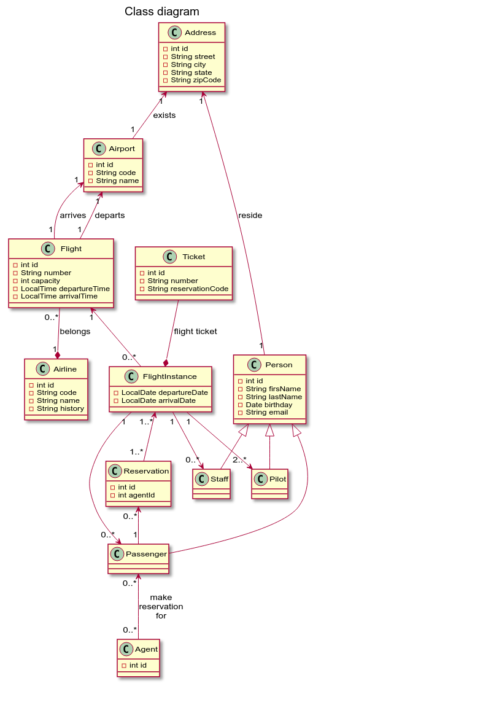
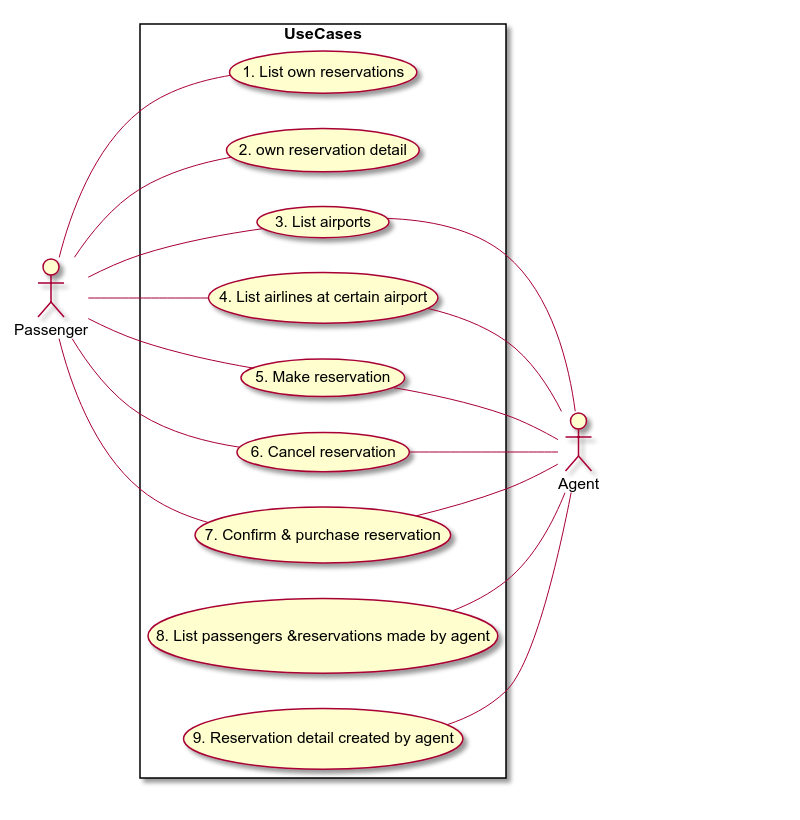
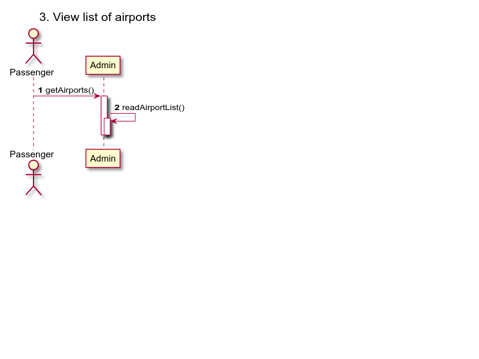
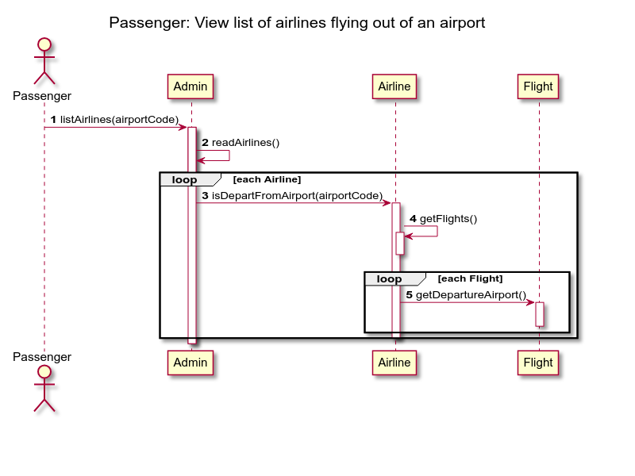
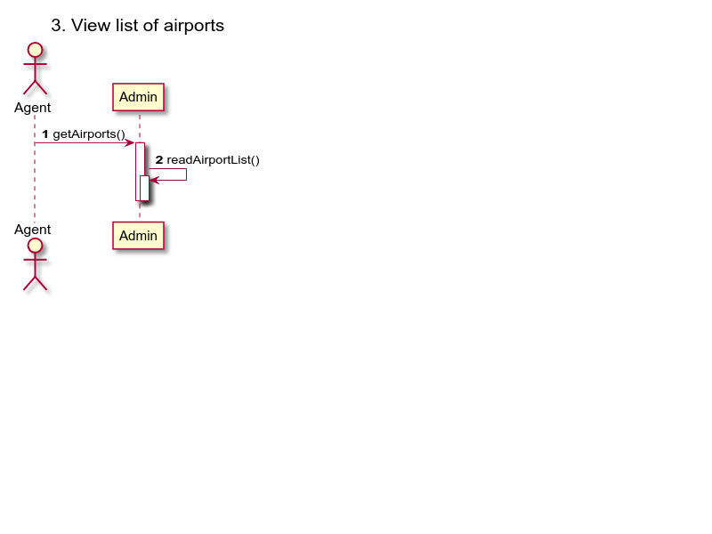
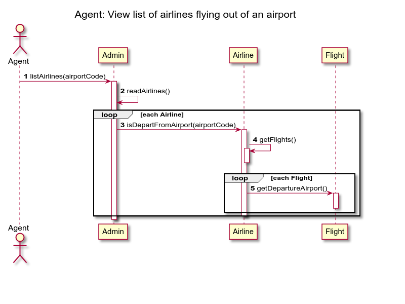

# Project diagrams

## Requirements

Follow the steps

1. Class diagram
2. Use case diagram
3. Sequence diagram

### 1. Class diagram

Class diagram PlanUML [source](1-class-diagram.md)

### 2. Use case diagram

Use case diagram PlanUML [source](2-use-case-diagram.md)

### 3. Sequence diagrams

#### 3.1 Sequence diagrams

Passenger: View list of airports

Sequence diagram PlanUML [source](3-1-sequence-diagram.md)

#### 3.2 Sequence diagrams

Passenger: View list of airlines flying out of an airport (search by airport three letter code)

Sequence diagram PlanUML [source](3-2-sequence-diagram.md)

#### 3.3 Sequence diagrams

Agent: View list of airports

Sequence diagram PlanUML [source](3-3-sequence-diagram.md)

#### 3.4 Sequence diagrams

Agent: View list of airlines flying out of an airport (search by airport three letter code)

Sequence diagram PlanUML [source](3-4-sequence-diagram.md)
