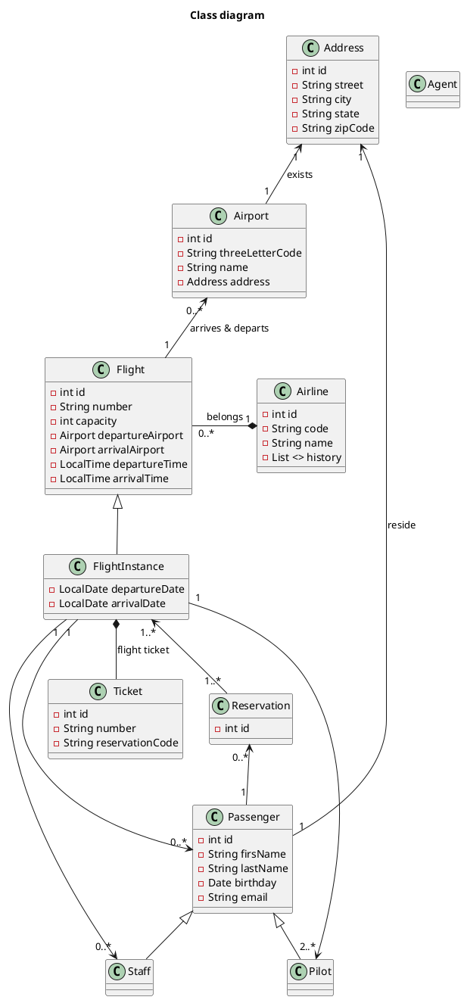
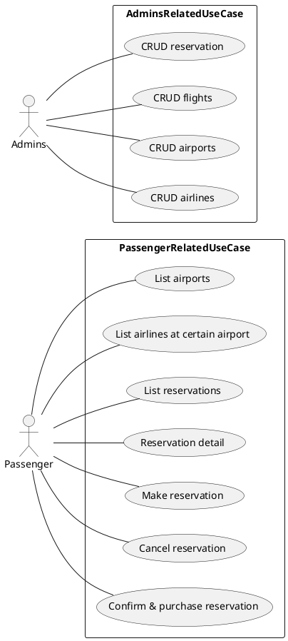

# Project diagrams

## Requirements

Follow the steps

1. Class diagram
2. Use case diagram
3. Sequence diagram

### Class diagram

```plantuml
@startuml

title Class diagram

class Airline {
    - int id
    - String code
    - String name
    - List <> history
}

class Airport {
    - int id
    - String threeLetterCode
    - String name
    - Address address
}

class Address {
    - int id
    - String street
    - String city
    - String state
    - String zipCode
}

class Flight {
    - int id
    - String number
    - int capacity
    - Airport departureAirport
    - Airport arrivalAirport
    - LocalTime departureTime
    - LocalTime arrivalTime
}

class FlightInstance {
    - LocalDate departureDate
    - LocalDate arrivalDate
}

class Passenger {
    - int id
    - String firsName
    - String lastName
    - Date birthday
    - String email
}

class Staff {
}

class Pilot {
}

class Reservation {
    - int id
}


class Ticket {
    - int id
    - String number
    - String reservationCode
}

class Agent {

}

Airline "1" *- "0..*" Flight : belongs
Airport "0..*" <-- "1" Flight : arrives & departs

Address "1" <-- "1" Airport : exists
Address "1" <-- "1" Passenger : reside

FlightInstance "1" --> "0..*" Passenger
FlightInstance *-- Ticket  : flight ticket
FlightInstance "1..*" <-- "1..*" Reservation
Reservation "0..*" <-- "1" Passenger

Flight <|-- FlightInstance
Passenger <|-- Pilot
Passenger <|-- Staff

FlightInstance "1" --> "2..*" Pilot
FlightInstance "1" --> "0..*" Staff

@enduml
```

### Use case diagram

```plantuml
@startuml
left to right direction

actor Passenger
rectangle PassengerRelatedUseCase{
    Passenger -- (List airports)
    Passenger -- (List airlines at certain airport)
    Passenger -- (List reservations)
    Passenger -- (Reservation detail)
    Passenger -- (Make reservation)
    Passenger -- (Cancel reservation)
    Passenger -- (Confirm & purchase reservation)
}

actor Admins
rectangle AdminsRelatedUseCase{
    Admins -- (CRUD reservation)
    Admins -- (CRUD flights)
    Admins -- (CRUD airports)
    Admins -- (CRUD airlines)
}

@enduml
```
