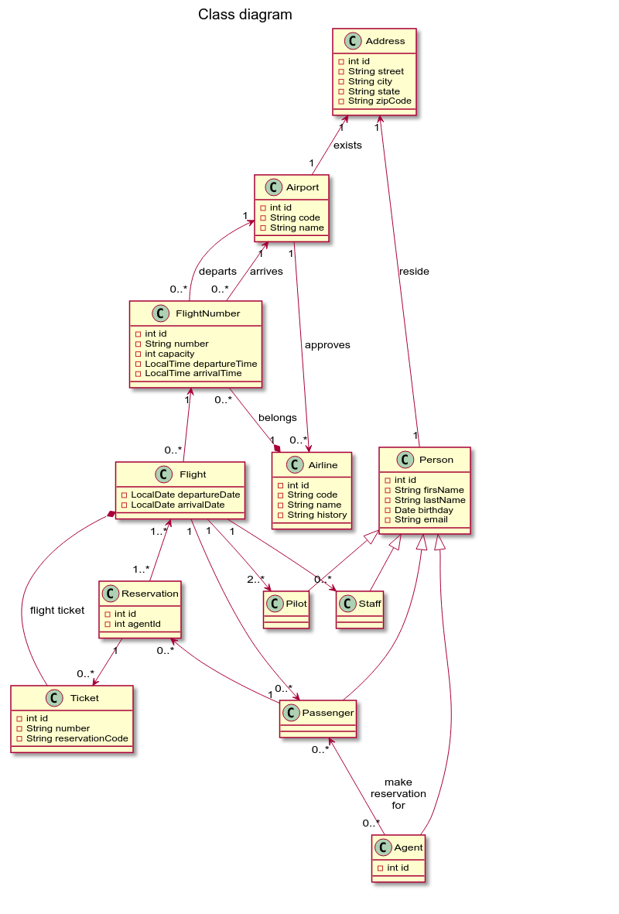
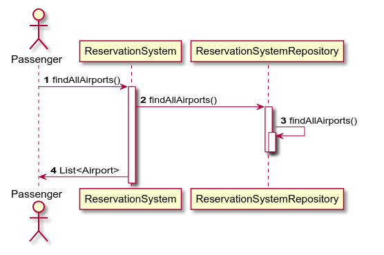

# Project diagrams

The steps to create

1. Class diagram
2. Use case diagram
3. Sequence diagram

Missing sequence diagrams
1. Passenger: View list of own reservations [diagram-7](#3.7-Sequence-diagram-7) 
2. Passenger: View details of a reservation (flights, departure times, etc.) [diagram-9](#3.9-Sequence-diagram-9)
3. Agent: Cancel a reservation [diagram-14](#3.14-Sequence-diagram-14)
4. Agent: Confirm and purchase a reservation. This will result in multiple tickets (one for each flight in the reservation) [diagram-16](#3.16-Sequence-diagram-16)

## 1. Class diagram

Class diagram PlantUML [source](plantuml/1-class-diagram.md)

## 2. Use case diagram

Use case diagram PlantUML [source](plantuml/2-use-case-diagram.md)

## 3. Sequence diagrams

## 3.1 Sequence diagram-1

Passenger: View list of airports

Sequence diagram PlantUML [source](plantuml/3-1-sequence-diagram.md)

## 3.2 Sequence diagram-2

Agent: View list of airports

Sequence diagram PlantUML [source](plantuml/3-2-sequence-diagram.md)

## 3.3 Sequence diagram-3

Passenger: View list of airlines flying out of an airport (search by airport three letter code)

Sequence diagram PlantUML [source](plantuml/3-3-sequence-diagram.md)

## 3.4 Sequence diagram-4

Agent: View list of airlines flying out of an airport (search by airport three letter code)

Sequence diagram PlantUML [source](plantuml/3-4-sequence-diagram.md)

## 3.5 Sequence diagram-5

Passenger: View list of flights between a departure and destination for a date

## 3.6 Sequence diagram-6

Agent: View list of flights between a departure and destination for a date

## 3.7 Sequence diagram-7
Passenger: View list of own reservations

## 3.8 Sequence diagram-8

Agent: View list of passengers and reservations made for them “by this agent”

Sequence diagram PlantUML [source](plantuml/3-8-sequence-diagram.md)

## 3.9 Sequence diagram-9
Passenger: View details of a reservation (flights, departure times, etc.)

## 3.10 Sequence diagram-10

Agent: View details of a reservation (flights, departure times, etc.) – only if done by this agent

Sequence diagram PlantUML [source](plantuml/3-10-sequence-diagram.md)

## 3.11 Sequence diagram-11

Passenger: Make a reservation (note: input will be a list of flights)

Sequence diagram PlantUML [source](plantuml/3-11-sequence-diagram.md)

## 3.12 Sequence diagram-12

Agent: Make a reservation (note: payload will be a list of flights)

Sequence diagram PlantUML [source](plantuml/3-12-sequence-diagram.md)

## 3.13 Sequence diagram-13

Passenger: Cancel a reservation

## 3.14 Sequence diagram-14
Agent: Cancel a reservation

## 3.15 Sequence diagram-15

Passenger: Confirm and purchase a reservation. This will result in multiple tickets (one for each flight in the reservation)

## 3.16 Sequence diagram-16
Agent: Confirm and purchase a reservation. This will result in multiple tickets (one for each flight in the reservation)