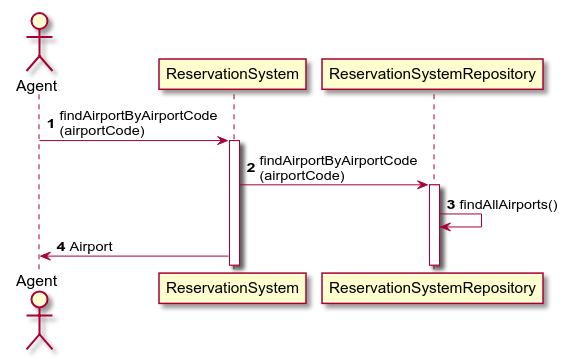

# Project diagrams

The steps to create

1. Class diagram
2. Use case diagram
3. Sequence diagram

## 1. Class diagram

Class diagram PlantUML [source](plantuml/1-class-diagram.md)

## 2. Use case diagram

Use case diagram PlantUML [source](plantuml/2-use-case-diagram.md)

## 3. Sequence diagrams

## 3.1 Sequence diagrams

Passenger: View list of airports

Sequence diagram PlantUML [source](plantuml/3-1-sequence-diagram.md)

## 3.2 Sequence diagrams

Agent: View list of airports

Sequence diagram PlantUML [source](plantuml/3-2-sequence-diagram.md)

## 3.3 Sequence diagrams

Passenger: View list of airlines flying out of an airport (search by airport three letter code)

Sequence diagram PlantUML [source](plantuml/3-3-sequence-diagram.md)

## 3.4 Sequence diagrams

Agent: View list of airlines flying out of an airport (search by airport three letter code)

Sequence diagram PlantUML [source](plantuml/3-4-sequence-diagram.md)

