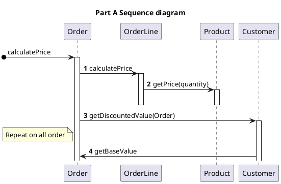
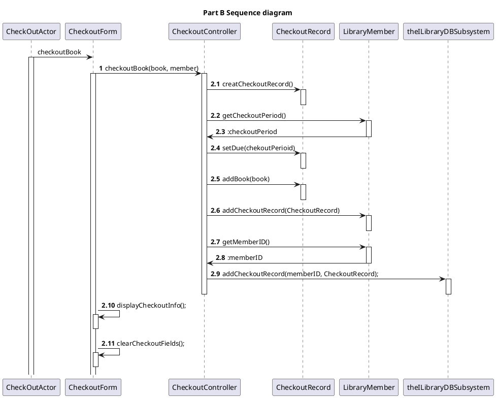
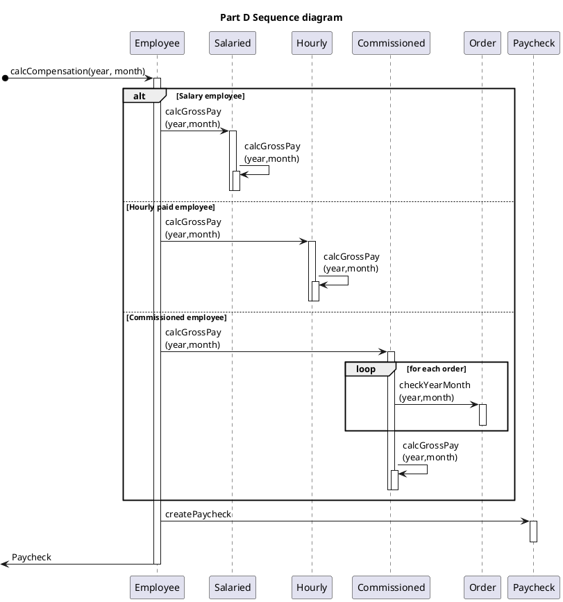

# Lab-4 Diagrams

## Part A

```plantuml
@startuml
title **Part A Sequence diagram**
[o-> Order : calculatePrice
activate Order
autonumber
Order -> OrderLine : calculatePrice
activate OrderLine

OrderLine -> Product : getPrice(quantity)
activate Product


deactivate OrderLine
deactivate Product

Order -> Customer : getDiscountedValue(Order)
note left of Order : Repeat on all order
activate Customer
Customer -> Order : getBaseValue


@enduml
```

## Part B

```plantuml
@startuml
title **Part B Sequence diagram**

CheckOutActor -> CheckoutForm : checkoutBook
activate CheckOutActor
autonumber
CheckoutForm -> CheckoutController : checkoutBook(book, member)
activate CheckoutForm
activate CheckoutController
autonumber 2.1
CheckoutController -> CheckoutRecord : creatCheckoutRecord()
activate CheckoutRecord
deactivate CheckoutRecord
CheckoutController -> LibraryMember : getCheckoutPeriod()
activate LibraryMember
CheckoutController <- LibraryMember : :checkoutPeriod
deactivate LibraryMember
CheckoutController -> CheckoutRecord : setDue(chekoutPerioid)
activate CheckoutRecord
deactivate CheckoutRecord

CheckoutController -> CheckoutRecord : addBook(book)
activate CheckoutRecord
deactivate CheckoutRecord

CheckoutController -> LibraryMember : addCheckoutRecord(CheckoutRecord)
activate LibraryMember
deactivate LibraryMember

CheckoutController -> LibraryMember : getMemberID()
activate LibraryMember
CheckoutController <- LibraryMember : :memberID
deactivate LibraryMember
CheckoutController -> theILibraryDBSubsystem : addCheckoutRecord(memberID, CheckoutRecord);

activate theILibraryDBSubsystem
deactivate theILibraryDBSubsystem
deactivate CheckoutController

CheckoutForm -> CheckoutForm : displayCheckoutInfo();
activate CheckoutForm
deactivate CheckoutForm
CheckoutForm -> CheckoutForm : clearCheckoutFields();
activate CheckoutForm
deactivate CheckoutForm
@enduml
```

## Part D

```plantuml
@startuml
title **Part D Sequence diagram**
[o-> Employee : calcCompensation(year, month)
activate Employee
alt Salary employee
    Employee -> Salaried : calcGrossPay\n(year,month)
    activate Salaried
    Salaried -> Salaried : calcGrossPay\n(year,month)
    activate Salaried
    deactivate Salaried
    deactivate Salaried
else Hourly paid employee
    Employee -> Hourly : calcGrossPay\n(year,month)
    activate Hourly
    Hourly -> Hourly : calcGrossPay\n(year,month)
    activate Hourly
    deactivate Hourly
    deactivate Hourly
else Commissioned employee
    Employee -> Commissioned : calcGrossPay\n(year,month)
    activate Commissioned
    loop for each order
        Commissioned -> Order: checkYearMonth\n(year,month)
        activate Order
        deactivate Order
    end
    Commissioned -> Commissioned : calcGrossPay\n(year,month)
    activate Commissioned
    deactivate Commissioned
    deactivate Commissioned
end

Employee -> Paycheck : createPaycheck
activate Paycheck
deactivate Paycheck
[<- Employee : Paycheck
deactivate Employee
@enduml
```
