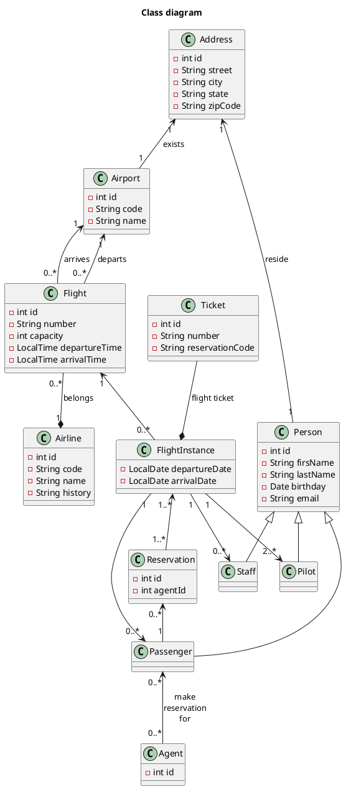

```plantuml
@startuml

title Class diagram

class Airline {
    - int id
    - String code
    - String name
    - String history
}

class Airport {
    - int id
    - String code
    - String name
}

class Address {
    - int id
    - String street
    - String city
    - String state
    - String zipCode
}

class Flight {
    - int id
    - String number
    - int capacity
    - LocalTime departureTime
    - LocalTime arrivalTime
}

class FlightInstance {
    - LocalDate departureDate
    - LocalDate arrivalDate
}

class Person {
    - int id
    - String firsName
    - String lastName
    - Date birthday
    - String email
}

class Passenger {
}

class Staff {
}

class Pilot {
}

class Reservation {
    - int id
    - int agentId
}


class Ticket {
    - int id
    - String number
    - String reservationCode
}

class Agent {
    - int id
}


Flight "0..*" --* "1" Airline : belongs
Airport "1" <-- "0..*" Flight : arrives
Airport "1" <-- "0..*" Flight : departs

Address "1" <-- "1" Airport : exists
Address "1" <-- "1" Person : reside

FlightInstance "1" --> "0..*" Passenger
Ticket --* FlightInstance : flight ticket
FlightInstance "1..*" <-- "1..*" Reservation
Reservation "0..*" <-- "1" Passenger

Flight "1" <-- "0..*" FlightInstance
Person <|-- Passenger
Person <|-- Pilot
Person <|-- Staff

Passenger "0..*" <-- "0..*" Agent : make\nreservation\nfor

FlightInstance "1" --> "2..*" Pilot
FlightInstance "1" --> "0..*" Staff

@enduml
```