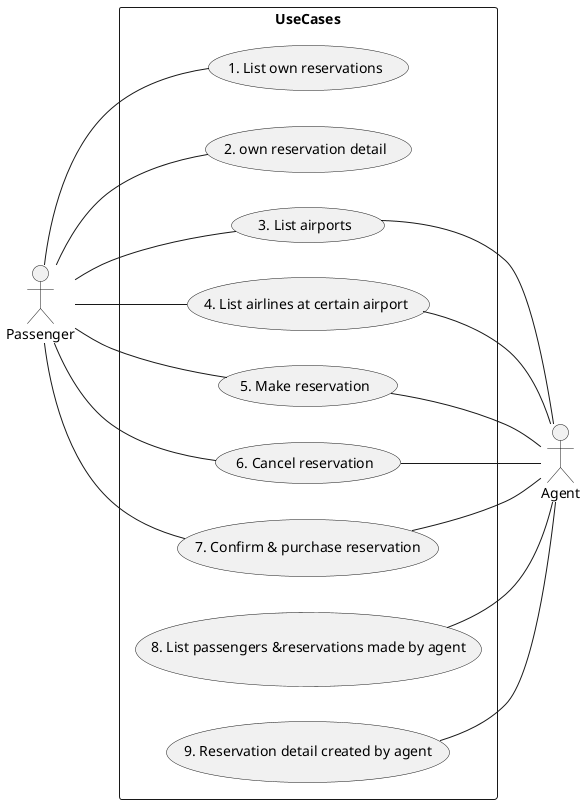

```plantuml
@startuml
left to right direction

actor Passenger
actor Agent

rectangle UseCases {
    Passenger -- (1. List own reservations)
    Passenger -- (2. own reservation detail)
    Passenger -- (3. List airports)
    Passenger -- (4. List airlines at certain airport)
    Passenger -- (5. Make reservation)
    Passenger -- (6. Cancel reservation)
    Passenger -- (7. Confirm & purchase reservation)

    (3. List airports) -- Agent
    (4. List airlines at certain airport) -- Agent
    (5. Make reservation) -- Agent
    (6. Cancel reservation) -- Agent
    (7. Confirm & purchase reservation) -- Agent
    (8. List passengers &reservations made by agent) -- Agent
    (9. Reservation detail created by agent) -- Agent
}

@enduml
```