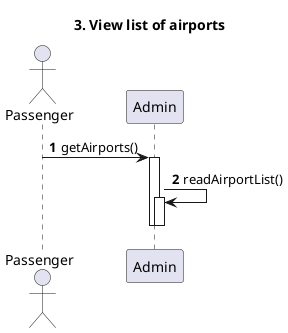

```plantuml
@startuml
title 3. View list of airports

Actor Passenger
autonumber
Passenger -> Admin : getAirports()
activate Admin
Admin -> Admin : readAirportList()
activate Admin
deactivate Admin
deactivate Admin

@enduml
```