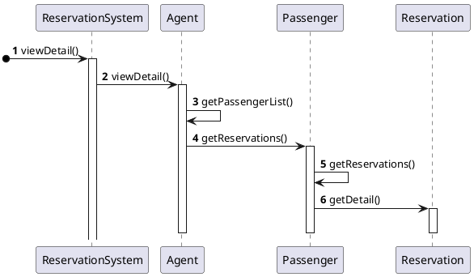

```plantuml
@startuml

autonumber
[o-> ReservationSystem : viewDetail()
activate ReservationSystem
ReservationSystem->Agent : viewDetail()
activate Agent
Agent -> Agent: getPassengerList()
Agent -> Passenger: getReservations()
activate Passenger
Passenger -> Passenger: getReservations()
Passenger -> Reservation: getDetail()
activate Reservation
deactivate Reservation
deactivate Passenger
deactivate Agent

@enduml
```