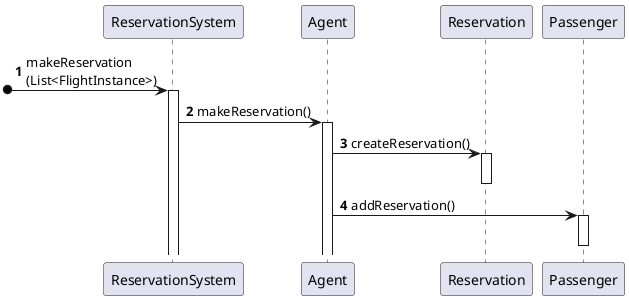

```plantuml
@startuml

autonumber

[o-> ReservationSystem: makeReservation\n(List<FlightInstance>)
activate ReservationSystem
ReservationSystem -> Agent: makeReservation()
activate Agent
Agent -> Reservation: createReservation()
activate Reservation
deactivate Reservation
Agent -> Passenger: addReservation()
activate Passenger
deactivate Passenger

@enduml
```