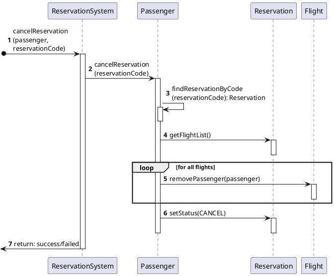

```plantuml
@startuml

autonumber

[o->ReservationSystem: cancelReservation\n(passenger,\nreservationCode)
activate ReservationSystem
ReservationSystem->Passenger: cancelReservation\n(reservationCode)
activate Passenger
Passenger -> Passenger: findReservationByCode\n(reservationCode): Reservation
activate Passenger
deactivate Passenger
Passenger -> Reservation: getFlightList()
activate Reservation
deactivate Reservation

loop for all flights
    Passenger->Flight: removePassenger(passenger)
    activate Flight
    deactivate Flight
end

Passenger -> Reservation: setStatus(CANCEL)
activate Reservation
deactivate Reservation
deactivate Passenger
[<-ReservationSystem: return: success/failed
deactivate ReservationSystem


@enduml
```