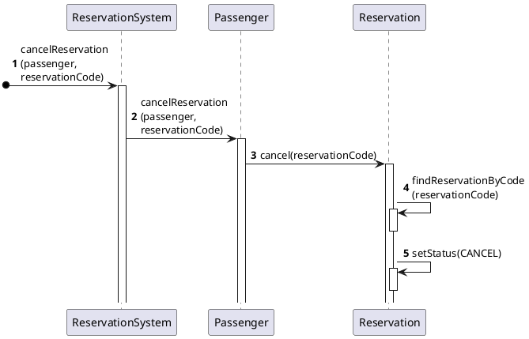

```plantuml
@startuml

autonumber

[o->ReservationSystem: cancelReservation\n(passenger,\nreservationCode)
activate ReservationSystem
ReservationSystem->Passenger: cancelReservation\n(passenger,\nreservationCode)
activate Passenger
Passenger -> Reservation: cancel(reservationCode)
activate Reservation
Reservation -> Reservation: findReservationByCode\n(reservationCode)
activate Reservation
deactivate Reservation
Reservation -> Reservation: setStatus(CANCEL)
activate Reservation
deactivate Reservation

@enduml
```