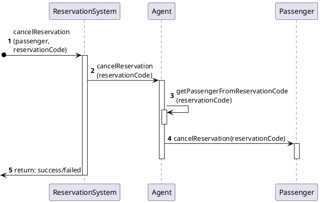

```plantuml
@startuml

autonumber

[o->ReservationSystem: cancelReservation\n(passenger,\nreservationCode)
activate ReservationSystem
ReservationSystem->Agent: cancelReservation\n(reservationCode)
activate Agent
Agent -> Agent: getPassengerFromReservationCode\n(reservationCode)
activate Agent
deactivate Agent

Agent->Passenger: cancelReservation(reservationCode)
activate Passenger
deactivate Passenger
deactivate Agent
[<-ReservationSystem: return: success/failed
deactivate ReservationSystem


@enduml
```