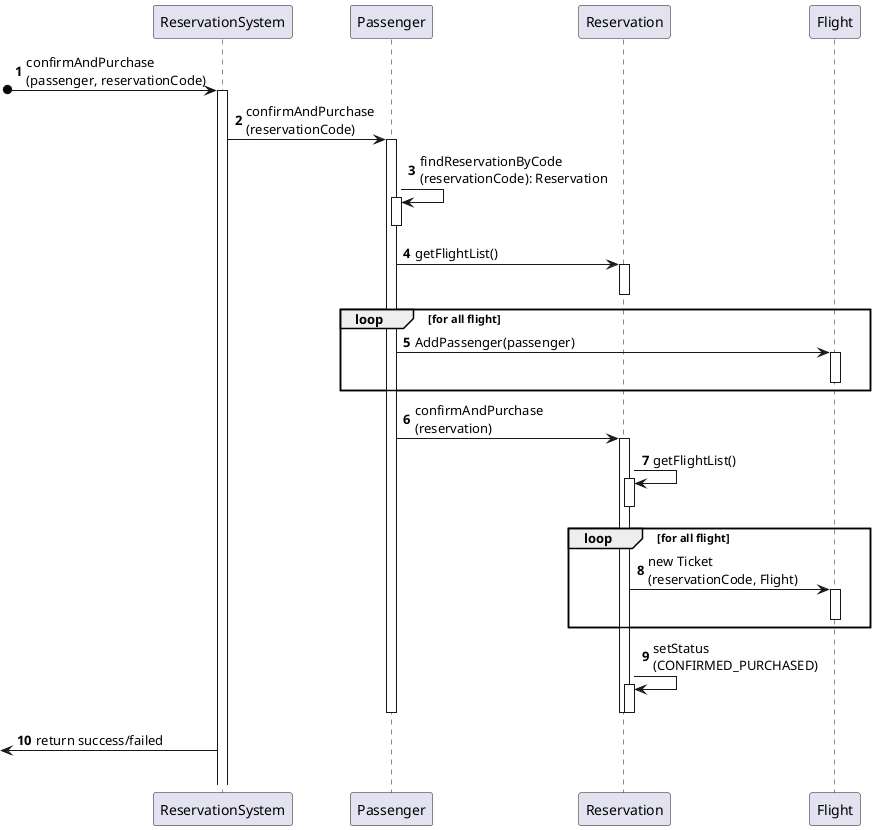

```plantuml
@startuml

autonumber

[o->ReservationSystem: confirmAndPurchase\n(passenger, reservationCode)
activate ReservationSystem
ReservationSystem -> Passenger: confirmAndPurchase\n(reservationCode)
activate Passenger
Passenger -> Passenger:findReservationByCode\n(reservationCode): Reservation
activate Passenger
deactivate Passenger

Passenger -> Reservation: getFlightList()
activate Reservation
deactivate Reservation

loop for all flight
    Passenger -> Flight: AddPassenger(passenger)
    activate Flight
    deactivate Flight
end


Passenger -> Reservation: confirmAndPurchase\n(reservation)
activate Reservation
Reservation -> Reservation: getFlightList()
activate Reservation
deactivate Reservation
loop for all flight
    Reservation -> Flight: new Ticket\n(reservationCode, Flight)
    activate Flight
    deactivate Flight
end

Reservation -> Reservation: setStatus\n(CONFIRMED_PURCHASED)
activate Reservation
deactivate Reservation
deactivate Reservation
deactivate Passenger

[<-ReservationSystem: return success/failed
|||


@enduml
```