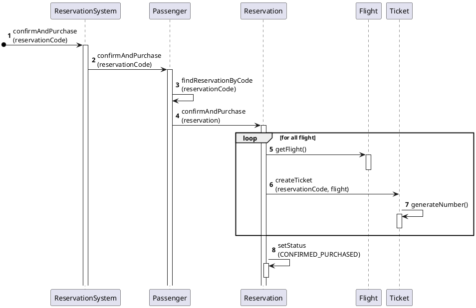

```plantuml
@startuml

autonumber

[o->ReservationSystem: confirmAndPurchase\n(reservationCode)
activate ReservationSystem
ReservationSystem -> Passenger: confirmAndPurchase\n(reservationCode)
activate Passenger
Passenger -> Passenger:findReservationByCode\n(reservationCode)
Passenger -> Reservation: confirmAndPurchase\n(reservation)
activate Reservation
loop for all flight
    Reservation -> Flight: getFlight()
    activate Flight
    deactivate Flight
    Reservation -> Ticket: createTicket\n(reservationCode, flight)
    Ticket -> Ticket: generateNumber()
    activate Ticket
    deactivate Ticket
end

Reservation -> Reservation: setStatus\n(CONFIRMED_PURCHASED)
activate Reservation
deactivate Reservation


@enduml
```