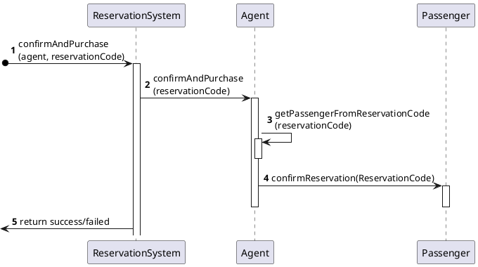

```plantuml
@startuml

autonumber

[o->ReservationSystem: confirmAndPurchase\n(agent, reservationCode)
activate ReservationSystem
ReservationSystem -> Agent: confirmAndPurchase\n(reservationCode)
activate Agent
Agent -> Agent: getPassengerFromReservationCode\n(reservationCode)
activate Agent
deactivate Agent
Agent->Passenger: confirmReservation(ReservationCode)
activate Passenger
deactivate Passenger
deactivate Agent
[<-ReservationSystem: return success/failed


@enduml
```