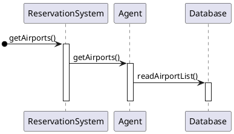

```plantuml
@startuml
[o-> ReservationSystem : getAirports()
activate ReservationSystem
ReservationSystem -> Agent: getAirports()
activate Agent
Agent -> Database : readAirportList()
activate Database
deactivate Database
deactivate Agent
deactivate ReservationSystem

@enduml
```