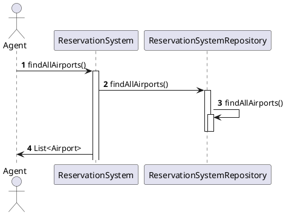

```plantuml
@startuml

Actor Agent

autonumber
Agent-> ReservationSystem : findAllAirports()
activate ReservationSystem
ReservationSystem -> ReservationSystemRepository: findAllAirports()
activate ReservationSystemRepository
ReservationSystemRepository -> ReservationSystemRepository : findAllAirports()

activate ReservationSystemRepository
deactivate ReservationSystemRepository
deactivate ReservationSystemRepository

ReservationSystem -> Agent: List<Airport>

@enduml
```