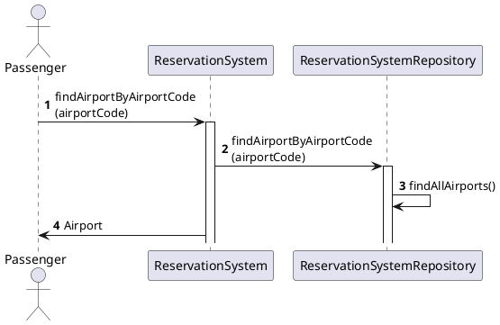

```plantuml
@startuml

Actor Passenger
autonumber
Passenger->ReservationSystem: findAirportByAirportCode\n(airportCode)
activate ReservationSystem

ReservationSystem -> ReservationSystemRepository: findAirportByAirportCode\n(airportCode)
activate ReservationSystemRepository
ReservationSystemRepository -> ReservationSystemRepository: findAllAirports()

ReservationSystem->Passenger: Airport

@enduml
```