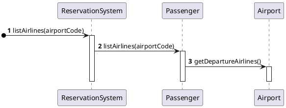

```plantuml
@startuml
autonumber

[o->ReservationSystem: listAirlines(airportCode)
activate ReservationSystem
ReservationSystem -> Passenger: listAirlines(airportCode)
activate Passenger
Passenger -> Airport : getDepartureAirlines()
activate Airport
deactivate Airport
deactivate Passenger
deactivate ReservationSystem

@enduml
```