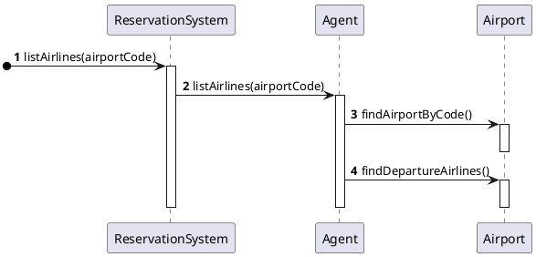

```plantuml
@startuml
autonumber

[o->ReservationSystem: listAirlines(airportCode)
activate ReservationSystem
ReservationSystem -> Agent: listAirlines(airportCode)
activate Agent
Agent -> Airport : findAirportByCode()
activate Airport
deactivate Airport
Agent -> Airport : findDepartureAirlines()
activate Airport
deactivate Airport
deactivate Agent
deactivate ReservationSystem

@enduml
```