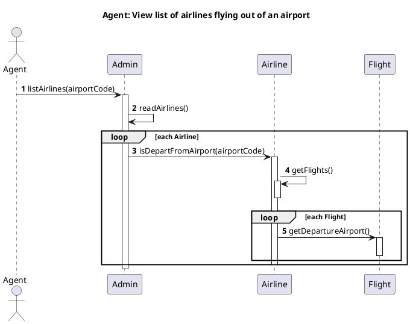

```plantuml
@startuml
title Agent: View list of airlines flying out of an airport

Actor Agent
autonumber
Agent -> Admin : listAirlines(airportCode)
activate Admin
Admin -> Admin : readAirlines()
loop each Airline
    Admin -> Airline: isDepartFromAirport(airportCode)
    activate Airline
    Airline -> Airline: getFlights()
    activate Airline
    deactivate Airline
    loop each Flight
        Airline -> Flight: getDepartureAirport()
        activate Flight
        deactivate Flight
    end
    deactivate Airline
end
activate Admin
deactivate Admin
deactivate Admin

@enduml

```