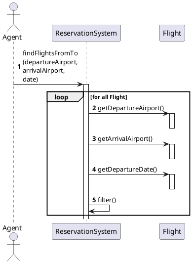

```plantuml
@startuml

Actor Agent
autonumber
Agent -> ReservationSystem: findFlightsFromTo\n(departureAirport,\narrivalAirport,\ndate)
activate ReservationSystem

loop for all Flight
    ReservationSystem -> Flight : getDepartureAirport()
    activate Flight
    deactivate Flight
    ReservationSystem -> Flight : getArrivalAirport()
    activate Flight
    deactivate Flight
    ReservationSystem -> Flight : getDepartureDate()
    activate Flight
    deactivate Flight
    ReservationSystem -> ReservationSystem: filter()
end

@enduml
```