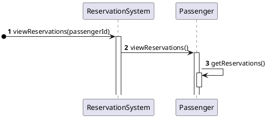

```plantuml
@startuml

autonumber
[o-> ReservationSystem: viewReservations(passengerId)
activate ReservationSystem
ReservationSystem -> Passenger : viewReservations()
activate Passenger
Passenger -> Passenger: getReservations()
activate Passenger
deactivate Passenger

@enduml
```