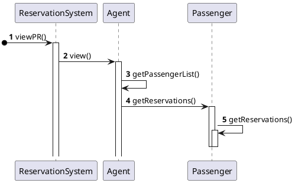

```plantuml
@startuml

autonumber
[o-> ReservationSystem: viewPR()
activate ReservationSystem
ReservationSystem -> Agent : view()
activate Agent
Agent -> Agent: getPassengerList()
Agent -> Passenger: getReservations()
activate Passenger
Passenger -> Passenger: getReservations()
activate Passenger
deactivate Passenger
deactivate Passenger

@enduml
```