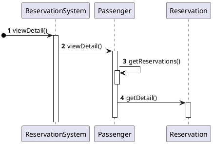

```plantuml
@startuml

autonumber
[o-> ReservationSystem : viewDetail()
activate ReservationSystem
ReservationSystem->Passenger : viewDetail()
activate Passenger
Passenger -> Passenger: getReservations()
activate Passenger
deactivate Passenger
Passenger -> Reservation: getDetail()
activate Reservation
deactivate Reservation
deactivate Passenger

@enduml
```